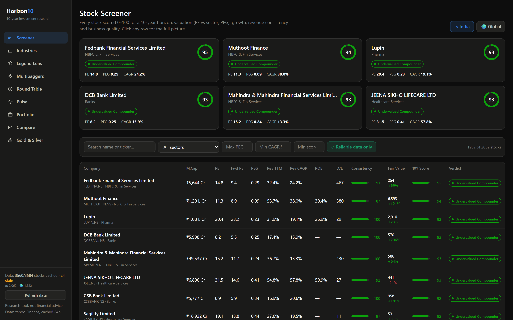
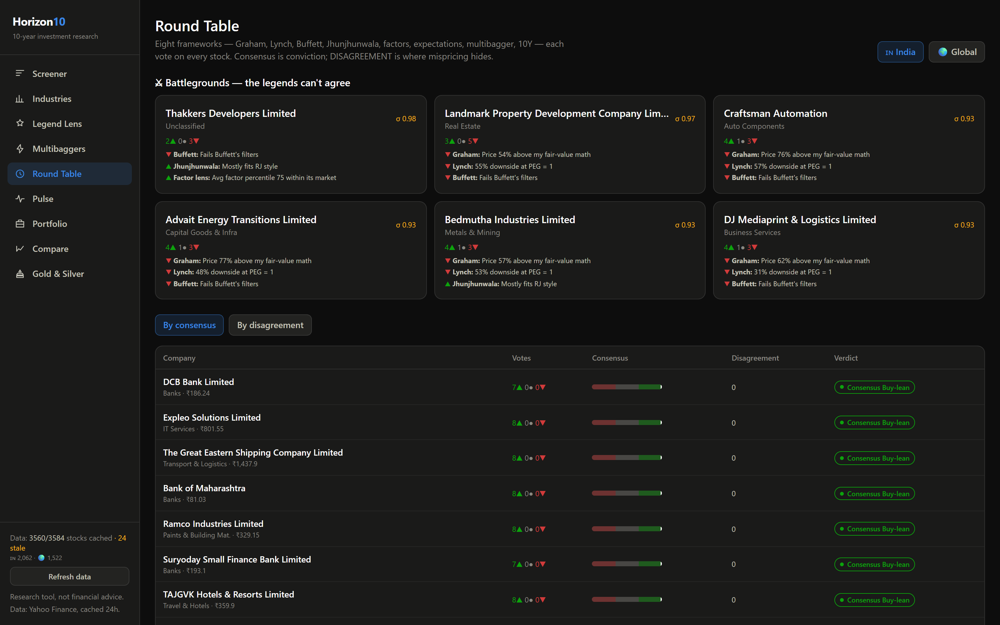
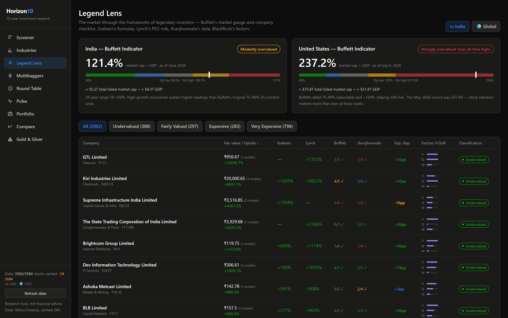
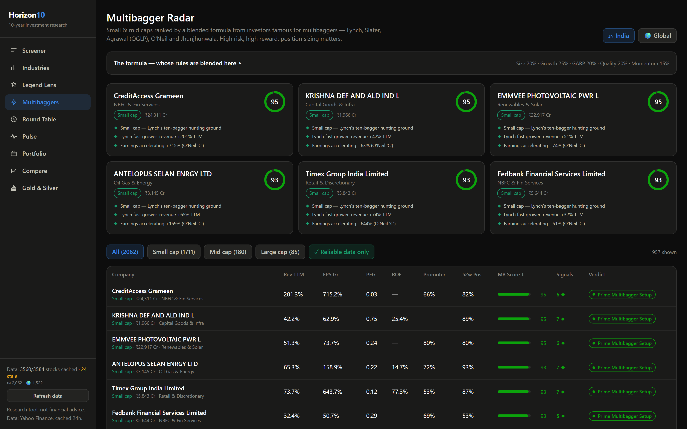
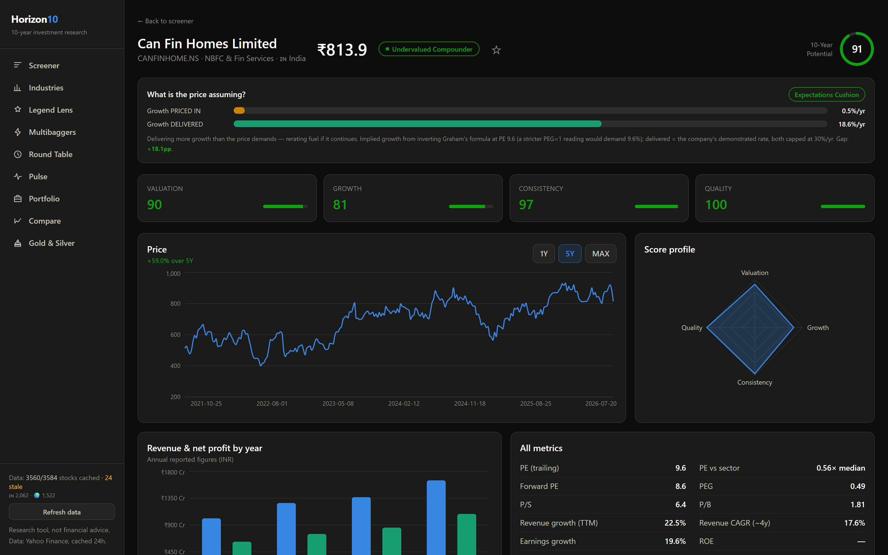

# Horizon10 — Investment Research Dashboard

> **3,584 stocks. 8 legendary investing frameworks. One local dashboard.**

Covers **the entire NSE main board (2,062 listings) plus the full S&P Composite
1500** — every listed Indian equity and the whole US large/mid/small-cap market —
scored for a **10-year horizon** on PE, PEG, revenue-growth consistency,
valuation and quality, then judged by the frameworks of Graham, Lynch, Buffett,
Jhunjhunwala, Slater, Agrawal, O'Neil and BlackRock. Plus gold, silver and
commodities. Runs entirely on your own machine.



📖 **[Read the full plain-English guide →](https://dhavalp5415.github.io/horizon10/)**
— how it works, what every screen does, and the actual formulas, written for a
non-technical reader. (Also served at `localhost:8000/guide` when the app is running.)

| | |
|---|---|
| **Coverage** | 2,062 India (all NSE main board) + 1,522 global (S&P 500/400/600 + ADRs) |
| **Speed** | Page data in 12–21 ms, even across 3,500+ scored stocks |
| **Stack** | Python · FastAPI · yfinance — React · TypeScript · Tailwind · Recharts |
| **Cost** | ₹0 — no API keys, no subscriptions, no account |

> **Disclaimer:** research tool, not financial advice. Scores are computed from
> public data and analyst estimates; nothing can guarantee 10-year outcomes.

## What makes it different

Most screeners collapse a stock into one rating. Horizon10 does four things
I couldn't find anywhere else:

1. **Expectations Gap** — instead of publishing *our* forecast, it inverts the price
   to reveal **the growth the market has already baked in**, then compares that with
   what the company actually delivers.
2. **Disagreement as a signal** — eight frameworks vote *independently*; the spread
   between them surfaces **battleground stocks** where the great investors would argue.
3. **Return DNA** — splits past returns into *business growth* vs *multiple re-rating*,
   so you can tell durable compounding from hype.
4. **Fundamental Twins** — finds the same quality/growth fingerprint **across sectors
   and across countries**, flagging the cheaper lookalikes.

| Round Table — where the legends disagree | Legend Lens — Buffett Indicator + fair values |
|---|---|
|  |  |

| Multibagger Radar | Stock deep dive |
|---|---|
|  |  |

## Run it

**Easiest:** double-click **`Start Horizon10.bat`** → opens http://localhost:8000
with the whole app (UI + API) served by one process. Close the window to stop.
To start it automatically at login, put a shortcut to the .bat in `Win+R` → `shell:startup`.

The FastAPI server serves the pre-built frontend from `frontend/dist`. After changing
frontend code, rebuild with `cd frontend && npm run build`.

**Development mode** (hot reload, two terminals):

```powershell
# Terminal 1 — backend (FastAPI on :8000)
cd backend
venv\Scripts\python.exe -m uvicorn main:app --port 8000

# Terminal 2 — frontend (Vite on :5173)
cd frontend
npm run dev
```

Open http://localhost:5173. First-time setup only:

```powershell
cd backend
python -m venv venv
venv\Scripts\python.exe -m pip install -r requirements.txt
venv\Scripts\python.exe build_universe.py   # collect every listed stock
venv\Scripts\python.exe warm_full.py        # download fundamentals (~75 min, resumable)
cd ..\frontend
npm install
```

## Pages

| Page | What it shows |
|---|---|
| **Screener** | Every stock with PE, Fwd PE, PEG, revenue TTM/CAGR, ROE, D/E, consistency, fair-value upside and the composite 10Y Score. Filter, sort, click through. India / Global tabs. |
| **Industries** | Sectors ranked by average score — the "best industries for 10 years" view, with top stocks per sector. |
| **Legend Lens** | Buffett Indicator gauges for India (~121%, June 2026) and the US (~237%, July 2026), plus every stock valued through Graham's formulas, Lynch's PEG=1 rule, Buffett's company checklist, Jhunjhunwala's style checklist and a BlackRock-style Value/Quality/Momentum factor lens. Median of the models → Undervalued / Fair / Expensive / Very Expensive. |
| **Pulse** | Every refresh writes a dated snapshot of all scores to `backend/ledger/`. Pulse diffs snapshots: upgrades, downgrades, valuation flips — each with metric-level attribution ("PE 34→28, growth 18%→24%"). |
| **Portfolio X-Ray** | Add your real holdings (persisted in `backend/data/portfolio.json`) — value-weighted 10Y/MB scores, expectations gap, sector concentration, red flags, plus a watchlist (☆ on any stock page). Non-INR values converted at live USDINR. |
| **Expectations Gap** (on every stock page + Legend Lens column) | Inverts Graham's formula to show the growth **already priced in** (g = (PE−8.5)/2) vs the growth the company **actually delivers** — verdicts from *Expectations Cushion* to *Extreme Hope*. Both sides capped at 30%/yr. |
| **Round Table** | Eight frameworks (Graham, Lynch, Buffett, RJ, factors, expectations, multibagger, 10Y) each cast a vote on every stock. Consensus ranking + **disagreement index (σ)** — "battleground" stocks where the legends split are surfaced as their own signal. |
| **Stock deep-dive cards** | **Decade Simulator** (interactive bear/base/bull 10-year projection with growth & exit-PE sliders, seeded from the Expectations Gap), **Twin Finder** (closest fundamental twins across all sectors & markets, cheaper ones flagged), **Return DNA** (past return decomposed into business growth vs multiple rerating). |
| **Multibagger Radar** | Small & mid caps ranked by a blended formula from investors famous for multibaggers: Lynch (size runway 20% + fast growth 25%), Slater's Zulu PEG (20%), Agrawal's QGLP quality (20%), O'Neil momentum + RJ promoter conviction (15%). Each stock lists the specific legendary rules it triggers; "Prime Multibagger Setup" requires score ≥ 72 **and** small/mid size. SEBI-style cap buckets (₹1.2 L Cr / ₹33k Cr cuts for India). |
| **Stock detail** | Price chart (1Y/5Y/Max), yearly revenue & net profit with growth badges, score radar, every metric with tooltips. |
| **Compare** | 2–4 stocks side by side: 5-year performance indexed to 100 + metric table. |
| **Gold & Silver** | 10-year trends (USD futures + INR ETFs), gold/silver ratio vs its average, 200-DMA momentum, allocation guidance. |

## The 10-Year Potential Score (0–100)

| Pillar | Weight | Inputs |
|---|---|---|
| Valuation | 30% | PE vs sector median, PEG (Yahoo's or PE ÷ forward growth), P/S vs sector |
| Growth | 30% | Revenue growth TTM, ~4-year revenue CAGR from income statements, earnings growth |
| Consistency | 20% | Share of years with positive revenue growth, volatility of growth |
| Quality | 20% | ROE, net & operating margins, debt/equity, FCF margin (D/E and FCF skipped for financials) |

Missing metrics are excluded (never guessed) and surfaced as a **data
completeness** percentage; stocks with <60% completeness are flagged "thin data".

## Legend Lens honesty notes

- **Graham Number** √(22.5×EPS×BVPS) and the **Graham growth formula** EPS×(8.5+2g) are his real formulas; **Lynch fair value** is his fair-PE-equals-growth rule (clamped 10–25×). Growth is capped at revenue growth + 8pp so one-off earnings spikes (cyclicals) don't inflate fair values.
- **Jhunjhunwala** and **BlackRock** left styles, not formulas — implemented as a labeled checklist and a factor percentile lens respectively.
- Value formulas are conservative by design: great growth franchises often read "Expensive" while scoring high on the 10Y screener. That tension is Buffett's "wonderful company at a fair price" question — the app shows both sides.
- Buffett Indicator readings are published constants in `backend/legends.py` (with as-of dates) — update them when they drift.

## The universe — how full coverage is built

| File | Role |
|---|---|
| `backend/universe.py` | Curated names (hand-checked labels/sectors) — the **override layer** |
| `backend/build_universe.py` | Collects candidates: NSE `EQUITY_L.csv` (SERIES=EQ) + S&P 500/400/600 from Wikipedia. No Yahoo calls. |
| `backend/warm_full.py` | Resumable, self-throttling fetch — one request per stock, skips anything cached, detects rate-limiting by probing a mega-cap and **re-queues** blocked stocks so none are lost |
| `backend/universe_auto.json` | Generated index (ticker, name, sector, market cap) |
| `backend/relabel_universe.py` | Re-derives sectors from cache after a mapping change (no network) |

Curated entries win on any ticker collision, so **nothing is duplicated**.
To rebuild from scratch:

```bash
venv\Scripts\python.exe build_universe.py && venv\Scripts\python.exe warm_full.py
```

Yahoo rate-limits aggressively. `warm_full.py` is safe to re-run — it resumes
where it left off, and stocks it could not reach are never blacklisted.

### Data quality at full-market scale
Thousands of micro-caps publish almost no fundamentals. Rather than hide them
or pretend to score them, every stock carries a **completeness** figure:
screens default to a **"Reliable data only" (≥50% of metrics)** toggle, industry
rankings only count well-covered stocks, and the Pulse feed ignores thin-data
noise. Flip the toggle to see the entire market including the sparse names.

## Notes & limitations

- Yahoo Finance fundamentals for Indian large caps are solid; some midcaps have
  gaps — that's what the completeness flag is for.
- Income statements give ~4 annual periods, so revenue CAGR and consistency are
  measured over that window.
- Tata Motors appears as its two demerged entities (TMPV / TMCV); LTIMindtree is
  currently not served by Yahoo and is excluded.
- To edit the universe, change `backend/universe.py` and click **Refresh data**.
